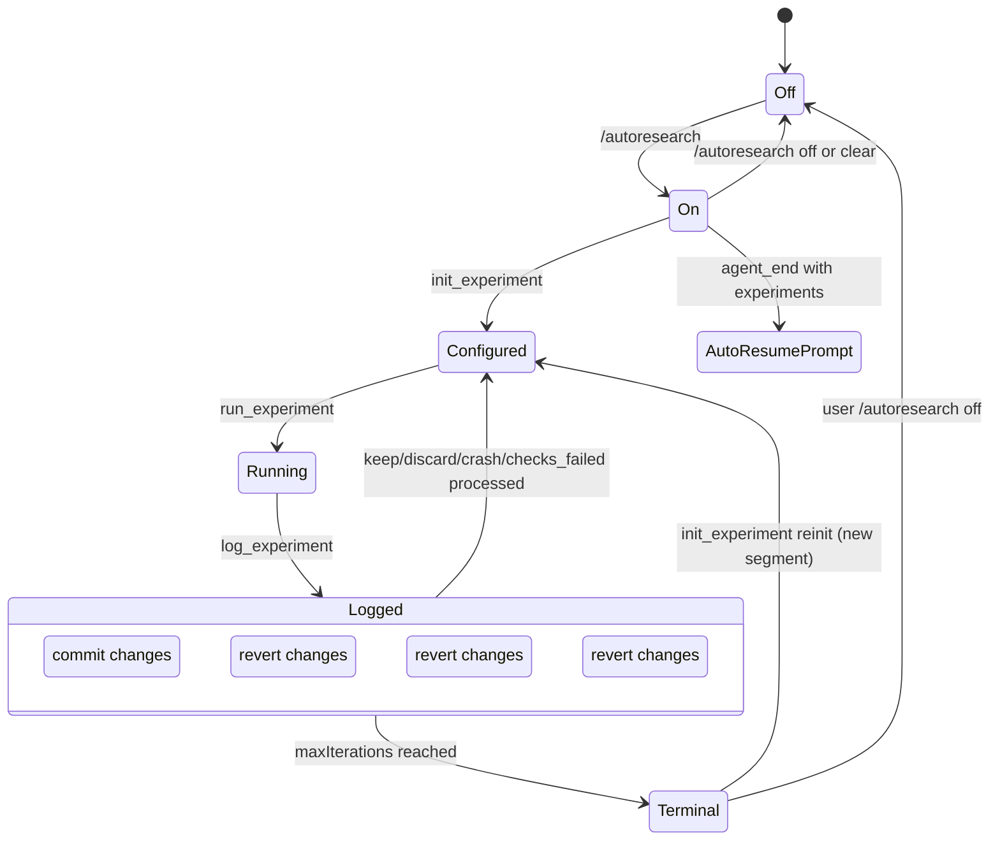
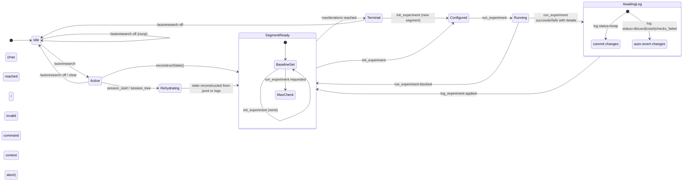
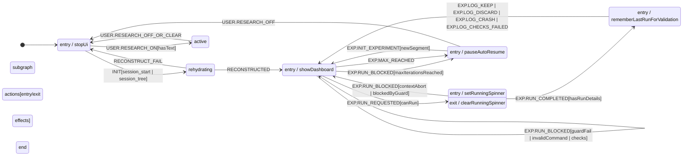

# pi-autoresearch Workflow & State-Machine Analysis

## Scope
Analysis of the cloned repo: `/home/behnam/workspaces/pi-autoresearch`

## 1) Core Workflow

This project is split into two parts:

- **Skill** (`skills/autoresearch-create/`): session bootstrapping and handoff to agent loop.
- **Extension** (`extensions/pi-autoresearch/index.ts`): execution loop runtime (tools, widget, persistence, metrics).

### Canonical Experiment Loop

1. `init_experiment`
   - Writes config header into `autoresearch.jsonl`.
   - Initializes experiment state for a new segment.

2. `run_experiment`
   - Executes command (guarded command path, timeout support).
   - Captures tail output, run duration, exit status.
   - Parses structured metric lines like `METRIC name=value`.
   - Optionally runs `autoresearch.checks.sh` after passing benchmark.

3. `log_experiment`
   - Records result (`keep|discard|crash|checks_failed`) into `autoresearch.jsonl`.
   - On `keep`: `git add -A && git commit`.
   - On non-keep: auto-revert workspace (preserves autoresearch session files).
   - Updates dashboard state and confidence score.

4. Repeat until stop/manual intervention or max-iterations rule.

### Finalization
`skills/autoresearch-finalize` + `skills/autoresearch-finalize/finalize.sh` take kept runs and split them into independent reviewable branches with overlap checks.

---

## 2) State Model (practical state machine)

### Runtime state (`AutoresearchRuntime`)
- `autoresearchMode`: whether extension is in autoresearch mode.
- `dashboardExpanded`: widget collapsed/expanded.
- `runningExperiment`: running command metadata (`startedAt`, `command`).
- `state`: embedded `ExperimentState`.
- token-tracking fields for context exhaustion prevention.
- auto-resume metadata (`lastAutoResumeTime`, `autoResumeTurns`, `experimentsThisSession`).

### Experiment state (`ExperimentState`)
- `results: ExperimentResult[]`
- `currentSegment`
- `bestMetric` (baseline for current segment)
- `bestDirection` (`lower` or `higher`)
- `metricName`, `metricUnit`
- `secondaryMetrics`
- `name`
- `maxExperiments` (optional)
- `confidence`

### Result record (`ExperimentResult`)
- `commit`, `metric`, `metrics`, `status`, `description`
- `segment`
- `timestamp`
- `confidence`
- `iterationTokens`
- `asi` (Actionable Side Information)

### Persisted log
- Always append to `autoresearch.jsonl`, including `type: config` headers and run entries.
- This acts as durable state and session replay source.

---

## 3) State Transitions (observed)



### Segment transition logic
- `init_experiment` increments `currentSegment` when reinitializing an existing session.
- Segment boundaries let the system archive prior runs while preserving full history.

---

## 4) Analytics & metrics logic

### Baseline and best
- Baseline is first run in current segment.
- Best metric is best **kept** metric in current segment.
- Runs are annotated with status, deltas, and baseline context for dashboard rendering.

### Confidence score
Computed in `computeConfidence()`:
- Uses current-segment results only.
- Requires at least 3 valid data points.
- Uses **MAD** (median absolute deviation) as noise estimator.
- Score = `abs(best_kept - baseline) / MAD`.

Interpretation:
- `>= 2.0x`: likely real
- `1.0x..2.0x`: above noise but marginal
- `< 1.0x`: within noise

### Structured output contract
`run_experiment` parses:
- `METRIC name=value` where name allows `\w`, `.`, `µ`
- first parsed metric matching current primary metric is used as primary
- others become secondary metrics in result logging suggestions.

### UI analytics (extension layer)
- Compact widget + expanded dashboard + fullscreen overlay
- Progress row includes best metric, deltas, confidence, secondary metric snapshots
- Browser dashboard (`/autoresearch export`) loads same log and renders chart + run table + trend overlays.

---

## 5) Key constraints / guardrails

- If `autoresearch.sh` exists, `run_experiment` enforces using that script.
- Optional `autoresearch.config.json` supports:
  - `workingDir`
  - `maxIterations`
- Optional `autoresearch.checks.sh` runs on benchmark pass and can force `checks_failed` status.
- Auto-revert logic keeps session files (`autoresearch.jsonl`, `.md`, `.ideas.md`, scripts) from being discarded.
- Context budget guardrails estimate token consumption and can stop loop when near exhaustion.

---

## 6) Files of interest

- Extension entrypoint: `extensions/pi-autoresearch/index.ts`
- Skill docs: `skills/autoresearch-create/SKILL.md`
- Finalize engine: `skills/autoresearch-finalize/finalize.sh`
- Finalize guide: `skills/autoresearch-finalize/SKILL.md`
- Session protocol: `README.md` and `assets/template.html`

## 7) Quick quality note
I noticed one minor hygiene issue while reviewing:
- `/autoresearch off` sets `runtime.pendingCompactResume` in one branch, but this field is not declared on `AutoresearchRuntime`.
- It appears harmless (extra dynamic property) but should likely be removed for consistency.

## 8) Formal state-machine view



Notes on semantics:
- **SegmentReady** = current segment is configured and ready for another run.
- **Running** = `run_experiment` child process is in flight and spinner/UI updates are live.
- **AwaitingLog** = benchmark finished and `log_experiment` is expected to be called.
- **Terminal** = `maxIterations` reached; no further automatic iteration unless reinitialized.

## 9) Concrete refactors to make state machine explicit (enum + reducer), without behavior changes

To make behavior deterministic while preserving current runtime output and side effects, introduce an explicit command reducer in small steps:

### 1) Add explicit phase enum + transition helpers

- Create enum types in `extensions/pi-autoresearch/index.ts`:
  - `enum AutoresearchModeState { Idle, Active, Rehydrating, SegmentReady, Running, AwaitingLog, Terminal }`
  - `enum ExperimentStatusEvent { Init, RunStarted, RunCompleted, LogApplied, MaxReached, ModeOff, ModeClear, ResumeScheduled, Error }`
- Add derived fields (non-invasive, optional at first):
  - `runtime.modeState: AutoresearchModeState`
  - `runtime.currentEvent?: string` (for debugging)
- Add transition guard helpers:
  - `isAllowedTransition(state, event)`
  - `isTerminalState(state)`
- Keep existing objects untouched; this enum layer is metadata + validation only initially.

### 2) Introduce a pure reducer for machine state

Add function:

```ts
function autoresearchReducer(
  state: AutoresearchRuntime,
  event: ExperimentEvent
): { next: AutoresearchRuntime; effects: RuntimeEffect[] }
```

- Keep side effects out of the reducer (pure function).
- `run_experiment`, `log_experiment`, command handlers should only dispatch events and execute returned effects.
- Existing behavior remains identical because effects are executed in the same order as today.

Suggested event types:
- `reconstruct_from_disk`
- `command_autoresearch_on`
- `command_autoresearch_off`
- `command_autoresearch_clear`
- `init_experiment_called`
- `run_requested`
- `run_completed`
- `log_requested`
- `log_applied`
- `max_iterations_hit`
- `agent_end`

### 3) Collapse implicit phase checks into explicit gating logic

Replace repeated checks like:
- `if (state.results.length === 0) ...`
- scattered `state.currentSegment` + segment math
- multiple implicit assumptions around `runtime.autoresearchMode`

with explicit reducer guards:
- `if (!canRunExperiment(runtime)) return` with `canRunExperiment` derived from enum + max-iteration status
- `if (!canLog(runtime)) ...`

This prevents accidental transitions in edge cases (e.g., `log_experiment` called after failed `run_experiment`).

### 4) Add machine action queue for pending run/log ownership

Add explicit `pendingRun` token/object in runtime:
- `runtime.pendingRunId: string | null`
- `runtime.lastRunSummary: RunDetails | null`

Set in `run_completed` and consumed in `log_experiment`.
- Prevents double-log or log of stale run after context switches.

### 5) Unify segment state updates

Centralize these operations in reducer actions:
- segment reset on reinit
- baseline recomputation
- confidence recompute
- secondary metric registry initialization

Currently this logic is spread across:
- `init_experiment`
- `reconstructState`
- `log_experiment`

Moving to transition handlers ensures each segment transition is deterministic and testable.

### 6) Keep backward-compatible persistence shape (important)

Do **not** change `autoresearch.jsonl` schema.
- Keep exact JSONL entries as-is.
- Continue to write:
  - `type: "config"`
  - full run entries with `run`, `commit`, `status`, `metric`, `metrics`, `asi`, etc.

### 7) Add exhaustive transition tests

Add a small unit test file (even in a lightweight script style) to assert:
- `Configured -> Running -> AwaitingLog -> SegmentReady` on normal run/log flow.
- blocked run path keeps machine in SegmentReady and does not log phantom transitions.
- terminal max-iteration transition blocks additional runs.
- off/clear always moves to Idle and clears overlay/UI state deterministically.

### 8) Small cleanup included in migration

As part of this refactor pass, fix the existing typo/hygiene item:
- remove undeclared `runtime.pendingCompactResume` write on `/autoresearch off`.
- optionally replace with explicit `modeState = AutoresearchModeState.Idle` transition.

## 10) Strict XState-style variant for implementation

The following is a concrete **strict** statechart you can port directly to `@xstate/fsm`/XState style reducers.



### Suggested strict machine definition (pseudo)

```ts
interface Ctx {
  config?: Config;
  lastRun?: RunSummary;
  pendingRunId?: string;
  currentSegment: number;
  maxExperiments?: number;
  results: ExperimentResult[];
  isModeActive: boolean;
}

type Ev =
  | { type: "USER.RESEARCH_ON"; text: string }
  | { type: "USER.RESEARCH_OFF_OR_CLEAR" }
  | { type: "INIT.RECONSTRUCT" }
  | { type: "EXP.INIT"; params: InitParams }
  | { type: "EXP.RUN"; command: string }
  | { type: "EXP.RUN_OK"; runId: string; run: RunDetails }
  | { type: "EXP.RUN_BLOCKED"; reason: "max_experiments" | "invalid_command" | "context_full" }
  | { type: "EXP.LOG"; status: "keep" | "discard" | "crash" | "checks_failed" }
  | { type: "EXP.MAX_REACHED" }
  | { type: "SYSTEM.RESET" };

const machine = {
  id: "autoresearch",
  initial: "idle",
  context: { currentSegment: 0, results: [], isModeActive: false },
  states: {
    idle: {
      on: {
        "USER.RESEARCH_ON": { target: "rehydrating", actions: ["setModeActive", "sendUserPrompt"] },
        "USER.RESEARCH_OFF_OR_CLEAR": { actions: ["ensureIdle"] },
        "INIT.RECONSTRUCT": "rehydrating",
      },
    },
    rehydrating: {
      on: {
        "INIT.RECONSTRUCT_OK": "segmentReady",
        "INIT.RECONSTRUCT_FAIL": "idle",
      },
    },
    segmentReady: {
      on: {
        "EXP.INIT": { target: "segmentReady", actions: ["resetSegment", "setConfig"] },
        "EXP.RUN": [
          { target: "running", cond: "canRun", actions: ["spawnRun", "setPendingRun"] },
          { target: "segmentReady", actions: ["emitRunBlocked"] },
        ],
        "USER.RESEARCH_OFF_OR_CLEAR": { target: "idle", actions: ["clearMode"] },
        "EXP.MAX_REACHED": "terminal",
      },
    },
    running: {
      on: {
        "EXP.RUN_OK": { target: "awaitingLog", actions: ["cacheRunSummary"] },
        "EXP.RUN_BLOCKED": "segmentReady",
      },
      entry: "showSpinner",
      exit: "hideSpinner",
    },
    awaitingLog: {
      on: {
        "EXP.LOG": [
          { cond: "isPendingRun", target: "segmentReady", actions: ["applyLogAndSideEffects"] },
          { target: "segmentReady", actions: ["rejectStaleLog"] },
        ],
        "USER.RESEARCH_OFF_OR_CLEAR": { target: "idle", actions: ["revertAndReset"] },
      },
    },
    terminal: {
      on: {
        "EXP.INIT": { target: "segmentReady", actions: ["newSegment"] },
        "USER.RESEARCH_OFF_OR_CLEAR": "idle",
      },
    },
  },
};
```

### Transition map (condensed)

| From → To | Trigger | Guard | Side effect |
|---|---|---|---|
| `idle` → `rehydrating` | `INIT.RECONSTRUCT` | Always | read `autoresearch.jsonl` / session history |
| `idle` → `segmentReady` | `USER.RESEARCH_ON` | has text | set mode + notify |
| `segmentReady` → `running` | `EXP.RUN` | `canRunSegment()` | spawn process + set `pendingRunId` |
| `segmentReady` → `segmentReady` | `EXP.RUN_BLOCKED` | `blockedByContext`/`maxIterations`/`invalidCommand` | keep UI state and return explanatory text |
| `running` → `awaitingLog` | `EXP.RUN_OK` | always | store `RunSummary`, keep mode active |
| `awaitingLog` → `segmentReady` | `EXP.LOG` | `isPendingRunId` | commit/revert + persist jsonl + recompute confidence |
| `segmentReady` → `terminal` | `EXP.MAX_REACHED` | remainingRuns==0 | append loop-stop and abort autopilot |

## 11) Why this is low-risk

- No wire protocol changes (`run_experiment`, `log_experiment`, `/autoresearch` keep existing names/signatures).
- No log format changes.
- Existing dashboards/UI render from already derived state fields and existing logs.
- Reducer only orchestrates ordering and guards; side effects (git, spawn, fs, ui) remain where they are but are made explicit by action type.

